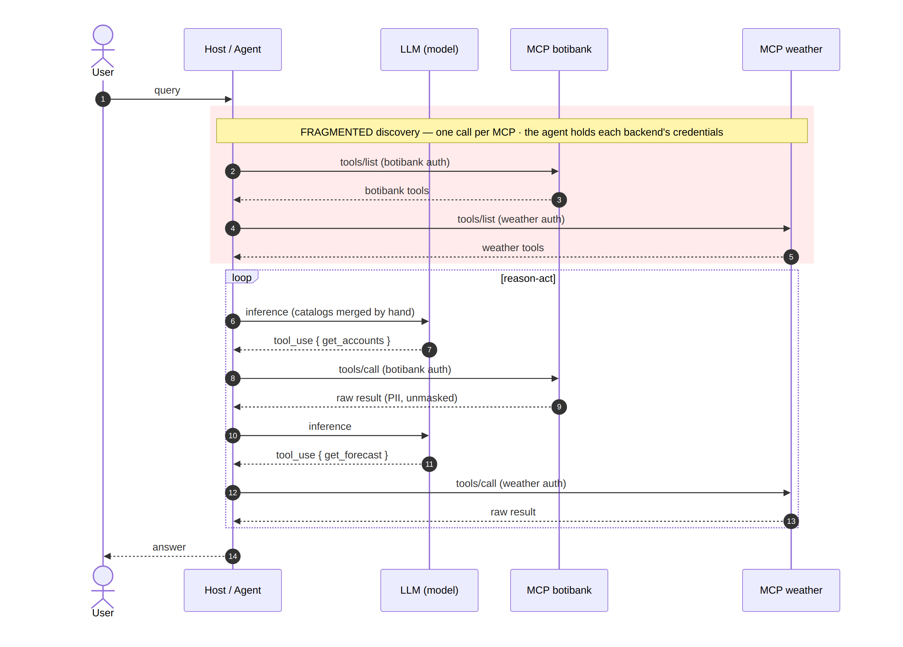
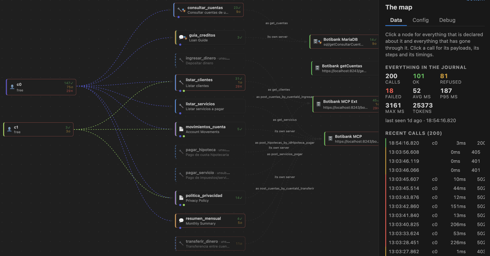

# The OpenTool Specification: A Contract-First Governance Layer for the Tools, Resources and Prompts of AI Agents

**Pablo D. Sagarna**  
28 September 2026\
[github.com/psagarna/open-tool-specification](https://github.com/psagarna/open-tool-specification)

---

## Abstract

The Model Context Protocol (MCP) has made it far simpler to expose backend capabilities to autonomous agents, but the control plane that decades of API management taught us to demand has not travelled with it. In an ecosystem of many MCP servers, each exposing tens or hundreds of tools, the agent runtime must discover and reach distributed capabilities on each server's own terms; when the full catalogue is loaded into a language model's context, a tool/context bloat raises token consumption, latency and inference cost, and compounds the complexity of tool routing and orchestration. This paper presents the OpenTool Specification (OTS), a declarative, language-agnostic contract that acts as a single source of truth for the tools, resources and prompts an agent may use, and a reference OTS Gateway that enforces that contract at runtime. OTS separates three concepts that usually stay coupled — what capability is offered, how it is discovered, and where and how it is executed — and the OTS gateway interposes on every agent–tool interaction to authenticate the caller, authorise per element and per consumer, meter consumption along the dimensions agents actually spend (requests and context tokens), validate arguments, translate to each backend's own security, mask and bound the response, and record the whole trip. Crucially, the same machinery governs all three MCP primitives uniformly, and a single element may be answered by a real MCP server, a SQL query, or its own declared scenarios. We describe the specification field by field, the gateway's runtime and configuration, the two-gate authorisation model, and an authoring and observability environment, and we position the work against OpenAPI, API gateways, service meshes and the MCP specification itself.

## 1. Introduction

The last two years turned "give the agent a tool" from a research demonstration into a production concern. MCP standardised how a model discovers and invokes remote capabilities, and the ecosystem answered with a large number of MCP servers wrapping databases, SaaS APIs and internal services. Integration became easy. Governing that integration did not.

The difficulty is structural. In an ecosystem of many MCP servers, each exposing tens — or even hundreds — of tools, the agent runtime has to manage discovery of and access to those distributed capabilities. When the full tool catalogue is loaded into the language model's context, a tool/context bloat appears: the model must process an ever-growing amount of metadata just to decide which tool best resolves each request. This can significantly increase token consumption, latency and inference cost, and it compounds the complexity of tool routing and orchestration.

The industry has met an analogous problem before. When organisations first exposed HTTP APIs at scale, the raw endpoint was never the artefact they shipped: an API gateway sat in front of it to handle authentication, authorisation, rate limiting, quotas, analytics and the translation between a public contract and a private backend. That discipline exists because direct, ungoverned access to backend capability is untenable once more than one consumer is involved. The tool layer of AI agents is roughly where APIs were before that discipline matured.

To mitigate this architectural inefficiency, the discovery layer must be consolidated and decoupled from the execution layer. The answer proposed here is a centralised capability catalogue that presents the agent with a unified, semantically consistent representation of the available tools, abstracting away their physical implementation and the concrete MCP server that ultimately runs the operation. This decoupling between a tool's semantic interface and its underlying execution mechanism is a foundational principle for regaining control over the scalability, governance and evolution of the agent ecosystem. The approach unlocks four engineering advantages that structure the rest of this paper:

- **Centralised governance and security** — audit the available tools and apply authorisation, RBAC, access control and policy enforcement at fine granularity, before a request ever reaches the corresponding backend.
- **A Design-First, accelerated SDLC** — an implementation-independent contract from which mocks, stubs and automated test environments are generated, so agent teams can design and validate workflows without waiting for the real MCP tool to be fully built.
- **Decoupling and independent evolution** — evolve a tool's implementation, change the underlying MCP server, or replace it entirely, without necessarily touching the semantic interface the agent consumes.
- **Optimised tool routing** — with a structured, normalised catalogue, the system can add semantic search, filtering, ranking or routing to hand the model only the tools relevant to each context.

In answer to these scalability, governance and control challenges, this paper introduces the OpenTool Specification (OTS): a declarative, language-agnostic contract that acts as the single source of truth for defining and exposing agent-facing capabilities. It rigorously standardises which tools, resources and prompts exist, strictly defines the data schemas they accept and return, and establishes the topology by which these interfaces map to their execution mechanisms — MCP servers included — in production. OTS thus separates three concepts that traditionally stay coupled: what capability is offered, how it is discovered, and where and how it is executed. That separation is what makes an agent architecture scalable, governable, and able to evolve independently of the infrastructure that implements each capability.

The contributions are: (1) a characterisation of the governance gap in agent tooling and of the two reference topologies it produces (Section 2); (2) the OTS contract, described field by field for all three MCP primitives, including output masking, scenario-based mocking, per-element scopes, and per-tool backend selection (Section 4); (3) a reference gateway that enforces the contract, with its runtime, configuration model and a two-gate authorisation scheme (Section 5); and (4) an authoring and observability environment that carries the gateway inside it (Section 6).

## 2. The governance gap and two reference topologies

Consider the same workload — an agent consuming tools from several MCP servers — under two topologies.

**Point-to-point (without OTS).** The agent talks directly to every MCP server, holding each backend's secrets. Discovery is fragmented: one `tools/list` per server, with no single catalogue. The agent sees every tool each server exposes, with no per-consumer allowlist. Raw responses, including personally identifiable information, flow straight into the model's context. And there is no single point at which to authorise per tool, cap consumption, or trace who called what. Each of these is a corollary of the same root cause: there is no interposition point at which policy can be applied.



**Centralised governed access (with OTS).** The agent points only at the gateway. The gateway returns one aggregate catalogue filtered by the caller's subscription, routes each call to the right MCP by the pair `(mcp, name)`, handles each backend's own security centrally — OAuth2 for one destination, an API key for another — and masks, bounds, rate-limits and traces every call, all under a single consumer, plan and quota. Point-to-point, every server authenticates, authorises and is discovered on its own terms; through the OTS gateway, one catalogue is published and every call is authorised, metered and recorded before it reaches a backend.

The central design decision follows directly: the agent's surface must collapse to a single governed endpoint, and the fan-out to heterogeneous backends must move behind that endpoint, where policy lives.


## 3. Design goals

Five goals shape the design. **Interposition by default:** the agent is configured to reach only the OTS gateway, and the OTS gateway alone reaches the backends, so policy is enforced where the agent cannot bypass it. **A declarative contract as the source of truth:** what exists, what it accepts and returns, and how it maps to a backend is described once and everything else is derived from it — the catalogue is built from the specification, never from the backend. **Authorisation at the granularity of the individual element, per consumer:** tools, resources and prompts are each independently grantable, and grants are attached to a subscription rather than to a server. **Consumption is metered and bounded** along the dimensions that matter for agents — requests and context tokens. **Every interaction is observable,** with secrets masked, so that the governance actions themselves can be audited. A sixth, cross-cutting goal is **uniformity across primitives:** whatever the system does for tools — declare, authorise, translate, mock, meter and record — it does identically for resources and prompts.

## 4. The OpenTool Specification

OTS describes an HTTP MCP tool the way OpenAPI describes a REST endpoint: a language-agnostic file that a person or a machine can read to know what the service does — without the source, without the documentation, and without watching the traffic. An OTS document declares three kinds of thing, and the same fields describe all three: tools, what the model decides to call; resources, what the application attaches to the model's context, by address; and prompts, templates the user picks, filled with arguments. The point of writing one is that the description is operational, not documentary: the same file says what the agent sees and how to reach the real service, so one document is simultaneously the contract, the translation, the validation, the test fixture and the governance rule.

### 4.1 Document structure

A document opens with its OTS version and an `info` block, a default `servers` entry naming where tools are served from unless one overrides it, a default `security` requirement that every tool inherits unless it declares its own, and the three primitive maps plus a `components` section for reuse.

```yaml
ots: "1.0.0"
info:
  title: "BotiBank Core Tools"
  version: "1.2.0"
servers:
  - protocol: streamable-http
    url: "https://localhost:8243/botibankmcp/1.0/mcp"
security:
  - AgentOAuthClientCredentials: []
tools: { }
resources: { }
prompts: { }
components: { }
```

### 4.2 A tool, field by field

A tool declares its identity, the prompt the model reads to decide whether to call it, the translation to the backend's own vocabulary, freshness and retry hints, and its input and output schemas.

```yaml
tools:
  consultar_cuentas:
    name: "consultar_cuentas"          # must equal the key, or the document is refused
    summary: "Consultar cuentas de un cliente"
    description: "Lista las cuentas bancarias de un cliente dado su ID."
    aiHints:
      whenToUse: "Úsalo para verificar el saldo de las cuentas de un usuario."
    backend:
      tool: "get_cuentas"              # what it is really called over there
      arguments:
        clienteId: "cliente_id"        # backend name ← agent name
    cache: { ttlMs: 300000 }
    idempotent: true
    inputSchema:
      type: "object"
      required: [ "cliente_id" ]
      additionalProperties: false
      properties:
        cliente_id: { type: "string", description: "ID del cliente (UUID)" }
```

The distinction between enforced and documentary fields is central to the contract's guarantees. The following fields are enforced by the runtime: `name` must equal the key of the map, or the document is refused; `backend` gives the name and argument shape the real MCP expects; `inputSchema` is validated on every call, before anything leaves; `outputSchema` is validated, masked and projected on the way back; `cache.ttlMs` contributes the shortest value among the visible tools as the `ttlMs` of `tools/list`; `idempotent` decides whether a failed call may be retried on a replica, and its absence reads as no, the safe reading for a contract that has not considered the question; `security` names the scopes the tool demands; `server` selects which backend answers this one tool; and `example`/`examples` supply what the mock answers with. By contrast `summary`/`description` and `icons` are shown and passed through, and `aiHints`, `policies` and `errors` are documentary today — candidates to become enforced.

### 4.3 What may leave: `outputSchema` and masks

Because MCP requires a tool with an `outputSchema` to answer with `structuredContent`, typed as an object, a list is always declared wrapped, never as a top-level `type: "array"`; a document that declares a bare array is refused. Fields of the output schema may carry an `x-ots-mask` directive, which masks a value before it reaches the agent — and therefore before it reaches a model's context, the trace and the journal.

```yaml
outputSchema:
  type: "object"
  properties:
    cuentas:
      type: "array"
      items:
        type: "object"
        properties:
          cuentaId:  { type: "string", x-ots-mask: "last4" }
          clienteId: { type: "string", x-ots-mask: "hash"  }
          saldo:     { type: "number" }
```

The mask vocabulary is `full` (renders as a fixed placeholder), `last4` and `first4` (reveal only an edge of the value), `email` (reveals the first character and the domain), `hash` (a SHA-256 digest that lets two records be correlated without exposing the value), and `drop` (the field disappears entirely). Masking on the response path is what keeps the model's context bounded and free of raw identifiers.

### 4.4 Scenarios: the contract answers on its own

A tool may name a few scenarios, pairing each request with its response and, importantly, including the failures. A tool with scenarios answers before its backend exists, which is what makes a specification something teams can develop against.

```yaml
    examples:
      default:
        input: { cliente_id: "71992c72-cc1c-4c5a-8b50-9ee4fb6c214d" }
        value:
          - { cuentaId: "CTA-122", saldo: 1800.50, tipo: "Corriente" }
      cliente_inexistente:
        input: { cliente_id: "00000000-0000-0000-0000-000000000000" }
        error: { code: -32602, message: "Cliente no encontrado" }
      tarea_larga:
        task: { pollsUntilDone: 2, pollIntervalMs: 300 }
        value: [ ]
```

Scenarios thus express not only the happy path but declared errors and long-running, poll-until-done tasks, so that the mocked contract behaves like the real service across the cases an agent must handle.

### 4.5 Scopes, per document or per tool

Security may be required at the document level, inherited by every tool, or narrowed to an individual tool that demands more than the agent's own credential. A tool lists security requirements as alternatives: satisfying any one of them is enough. Operations that move money are the archetype: they are marked non-idempotent so they are never retried, and they demand a delegated user scope rather than the agent's machine credential.

```yaml
  transferir_dinero:
    name: "transferir_dinero"
    backend:
      tool: "post_cuentas_by_cuentaId_transferir"
      arguments:
        cuentaId: "cuenta_origen"
        "requestBody.cuentaDestino": "cuenta_destino"   # dotted paths reach into the body
    idempotent: false
    security:
      - UserDelegationOAuth: [ "bank:transfer:execute" ]
    errors:
      "402":
        rpcCode: -32000
        description: "Saldo insuficiente."
        aiAction: "Dile que la cuenta origen no tiene fondos."
```

Dotted argument paths reach into the request body, and the `errors` map translates a backend status into words an agent can act on.

### 4.6 Which backend answers a tool

The document-level `servers` entry is the default execution target, but any single tool can override it — and the override need not be another MCP server. A tool may be answered by a database, its `server` pointing at a parameterised query:

```yaml
    server:
      - protocol: database
        url: "mariadb://127.0.0.1:3306/botibank?getCuentasByCliente"
```

This is the concrete expression of decoupling the semantic interface from the execution mechanism: to the agent, a SQL-backed tool and an MCP-backed tool are indistinguishable — they share the same contract.

### 4.7 Resources and prompts

Resources are addressed by a fixed `uri` or a parameterised `uriTemplate`, carry a `mimeType` and a cache hint, and may declare an inline `example` so they resolve without a backend. Prompts declare typed, possibly required arguments and an example message set.

```yaml
resources:
  politica_privacidad:
    uri: "ots://botibank/politica-privacidad"
    mimeType: "text/markdown"
    example: |
      # Política de privacidad v2.1
  movimientos_cuenta:
    uriTemplate: "ots://botibank/cuentas/{cuentaId}/movimientos"
    mimeType: "application/json"
prompts:
  resumen_mensual:
    arguments:
      - { name: "cuenta_id", required: true }
```

Because the same descriptive fields, scenarios, scopes and backend selection apply to all three primitives, resources and prompts are governed exactly as tools are, closing the gap in which two of MCP's three primitives are typically consumed with no authorisation, quota or trace.

### 4.8 Shared schemas and security schemes

A `components` section holds reusable JSON schemas referenced by tools, and named security schemes. Two OAuth2 flows recur: a client-credentials flow for the agent's machine-to-machine token, and an authorisation-code flow for the end user's delegated approval of operations that move funds.

```yaml
components:
  securitySchemes:
    AgentOAuthClientCredentials:
      type: oauth2
      flows:
        clientCredentials:
          tokenUrl: "https://localhost:8243/oauth2/token"
          scopes: { "mcp:invoke": "Llamada básica a herramientas" }
    UserDelegationOAuth:
      type: oauth2
      flows:
        authorizationCode:
          authorizationUrl: "https://localhost:8243/oauth2/authorize"
          tokenUrl: "https://localhost:8243/oauth2/token"
          scopes: { "bank:transfer:execute": "Aprobación de movimientos de fondos" }
```

## 5. The OTS Gateway

The reference implementation is the only component that today reads an OTS document and does something with it: a single Go binary with no runtime, no database of its own and no sidecar. Agents never talk to the MCP servers; they talk to the gateway, which authenticates the agent, authorises tool by tool with the scopes the contract demands, charges for it — rate, hourly and daily quotas, and a token budget for the context the answers spend — proxies the call while handling whatever the backend needs, validates and masks what comes back, and records the whole trip: the agent's request, what went to the backend, what came back, and what the agent finally received. It serves the three primitives across three revisions of the MCP protocol, and any element may be answered by another MCP server, by a SQL query, or by its own scenarios.

### 5.1 Configuration: `ots.json`

The gateway is configured through a single `ots.json`, the central configuration source for the runtime. It defines the embedded gateway server settings, together with one or more OTS specifications the gateway will publish; at startup the gateway reads the configuration and exposes the configured capabilities to agents and consumers. Beyond authenticate-authorise-proxy, the gateway can mock a tool from the specification's own examples so an agent is exercised end to end before the backend exists; serve a tool from a database, a SQL query becoming an MCP tool with the same contract as any other; and it is the locus where further governance and execution capabilities are expected to land.

```jsonc
{
  "otsgateway": { "server_port": "7082", "watch_files": true },
  "dashboard":  { "port": "7084", "access_key": "env:OTS_DASHBOARD_KEY" },
  "console":    { "port": "7085", "access_key": "env:OTS_CONSOLE_KEY"  },
  "mock_server":{ "enabled": true, "server_port": "7086" },
  "telemetry":  { "file": "logs/transactions.jsonl", "max_history": 500 },
  "plans": {
    "free": { "rate_per_second": 2, "burst": 5,
              "quota_hourly": 60, "quota_daily": 500,
              "tokens_hourly": 50000, "max_tokens_per_call": 12000 }
  },
  "mcps": [{
    "name": "botibank",
    "context_path": "/botibank",
    "ots_file": "boti-bank-ots.yaml",
    "output": { "enforce": "warn" },
    "backend_server": [
      { "name": "Core",
        "url": "https://localhost:8243/botibankmcp/1.0/mcp",
        "security": { "type": "OAuth2",
                      "token_url": "https://localhost:9443/oauth2/token",
                      "consumer_key": "env:BOTIBANK_KEY",
                      "consumer_secret": "env:BOTIBANK_SECRET" } },
      { "name": "Cuentas", "type": "database",
        "url": "mariadb://127.0.0.1:3306/botibank?getCuentasByCliente",
        "query_file": "sql/getCuentas.sql",
        "security": { "type": "password", "username": "app", "password": "env:DB_PASSWORD" } }
    ]
  }],
  "subscriptions": [{
    "consumer_name": "c0",
    "security": [{
      "mcps": [{ "botibank": {
        "tools": [ { "transferir_dinero": ["bank:transfer:execute"] }, "consultar_cuentas" ],
        "resources": [ { "movimientos_cuenta": ["cuentas:read"] }, "politica_privacidad" ],
        "prompts": [ { "revisar_clientes": ["clientes:read"] }, "resumen_mensual" ]
      } }],
      "auth_method": [{ "api_key": "env:C0_API_KEY" }],
      "key_plan": "free"
    }]
  }]
}
```

Each MCP has its own `context_path`, giving it a private endpoint alongside the aggregate one; an `output.enforce` mode of off, warn or reject governs how strictly the output schema is applied per MCP; and each backend server carries its own security, whether OAuth2 against a token endpoint or a password against a database. A plan bounds a consumer's rate and burst, hourly and daily request quotas, and hourly and per-call token budgets. A subscription binds a consumer to the tools, resources and prompts of each MCP it may reach, the credential it presents (an API key or an OAuth client), and the plan that governs it.

### 5.2 Two gates

Authorisation answers two different questions with two independent gates. The allowlist says what this consumer may touch, and denies by default. The specification's `security:` says what that primitive demands, and the credential has to satisfy it — the scope claim of a bearer token, or, for an API key which has nowhere else to carry a scope, what the configuration declares beside it. Placing the scopes on the allowlist entry narrows them to the primitive that needs them: a key entered as `{ "transferir_dinero": ["bank:transfer:execute"] }` carries that scope when it transfers money and nowhere else, which differs from a credential-wide scope carried into every call. The entry forms compose precisely:

| Allowlist entry | What the credential shows there |
|---|---|
| `"consultar_cuentas"` | its own scopes: what a bare allowlist entry has always meant |
| `{ "transferir_dinero": ["bank:transfer:execute"] }` | that scope, and only for that tool |
| `{ "consultar_cuentas": [] }` | nothing: it satisfies only a contract that demands none |
| `{ "estado_servicio": ["*"] }` | the contract of that one is not applied to this consumer |

Against a bearer token, the configuration can only narrow what the provider granted, never add to it. The wildcard exemption is the one way past the contract, and it has to be written explicitly: silence never widens anything, so an existing subscription never changes meaning when a new capability is introduced.

### 5.3 Running a deployment

A deployment starts without a build step, in either of two ways. From the editor, a single cross-platform package installs and is pointed at the gateway binary it should run; a "new deployment" command writes a working specification, an `ots.json`, the secrets and a `.gitignore`, and starts it with its log in the editor's output channel. From the command line, a single architecture-specific binary runs directly against an `ots.json`, with a checksum manifest to confirm nothing was tampered with and a version flag to identify the build. Either way, the first thing the log prints is where everything is — the aggregate gateway endpoint and each MCP's own endpoint, the dashboard and console links with their access keys already resolved, the mock server, and the journal file. A deployment written by the tool is mocked from the specification's own scenarios, so its tools answer before any backend exists, and a credential that is missing stops the gateway on load, by name, rather than at the first call. When `watch_files` is set, a change to the configuration is applied live.

## 6. OTS Designer: authoring and observability (VS Code Plugin)

A companion tool for the editor serves both to write the specification and to watch what the OTS gateway does with it; it carries the gateway inside, so installing the extension is the whole installation. The specification is edited as a form over tools, resources, prompts, schemas and scenarios, where every edit replaces exactly the value it changes so that comments, key order and formatting survive. The deployment is edited as a form over plans, consumers, credentials and MCPs, with a secret store that never shows a value back. A live map shows who calls, what they call and what answers, with every call travelling it in real time, and a permission is granted by dragging a line between a consumer and a capability. Any tool can be turned into a ready-to-run `curl` for a chosen consumer against the backend or the mock, a breakpoint can hold a real in-flight call to inspect what the agent asked and what is about to happen, and an entire working deployment can be generated from nothing.



## 7. Related work

OpenAPI/Swagger established the value of a machine-readable contract for APIs REST and the tooling that derives from it — documentation, client and server generation, mocking and testing. OTS is the deliberate analogue for the MCP tool layer, extended to cover resources and prompts and to carry the execution mapping and governance rules in the same file. API gateways and API-management platforms supply authentication, rate limiting, quotas and analytics for HTTP APIs; this work carries that discipline across the semantic gap to MCP, where the unit is a named tool rather than a URL, the caller is a probabilistic model, and the metered resource includes context tokens. Service meshes govern service-to-service traffic at the network layer but are agnostic to the application-level notion of a tool, a scope or a prompt template. Finally, the MCP specification defines the three primitives and their transport; OTS sits above it as a contract, and the gateway speaks several revisions of the protocol to consumers while presenting one governed catalogue.

## 8. Conclusion

Making a capability reachable by an agent and making it governable are different problems, and the ecosystem has solved the first while largely leaving the second to each server's own terms. The result is a tool layer with no single point of control, coarse or absent authorisation, no consumption limits, no consolidated trace, backend secrets spread across clients, an unmasked output path, and two of three primitives effectively ungoverned — all while the growing catalogue inflates the model's context. The OpenTool Specification (OTS) provides the missing contract: a single declarative, language-agnostic document that defines what a tool, resource, or prompt is, what it accepts and returns, how it maps to a real backend, who may invoke it, and what it costs. Furthermore, by centralising capability discovery within a single governed catalogue, OTS eliminates the need for agents to interact with multiple MCP servers individually. A single request to the OTS endpoint replaces numerous distributed discovery calls, reducing architectural complexity, minimising context consumption, and enabling consistent governance across the entire ecosystem. The reference OTS gateway supplies the missing governance, interposing on every call to authenticate, authorise per element and per consumer, meter along the dimensions agents actually spend, translate each backend's security, mask and bound the response, and record the whole trip — uniformly across tools, resources and prompts, and whether the answer comes from an MCP server, a database or the contract's own scenarios. Separating what is offered from how it is discovered and where and how it is executed is what makes such an architecture scalable, governable, and able to evolve independently of the infrastructure beneath it.

*The system described here is released as open source under the Apache License 2.0.*
