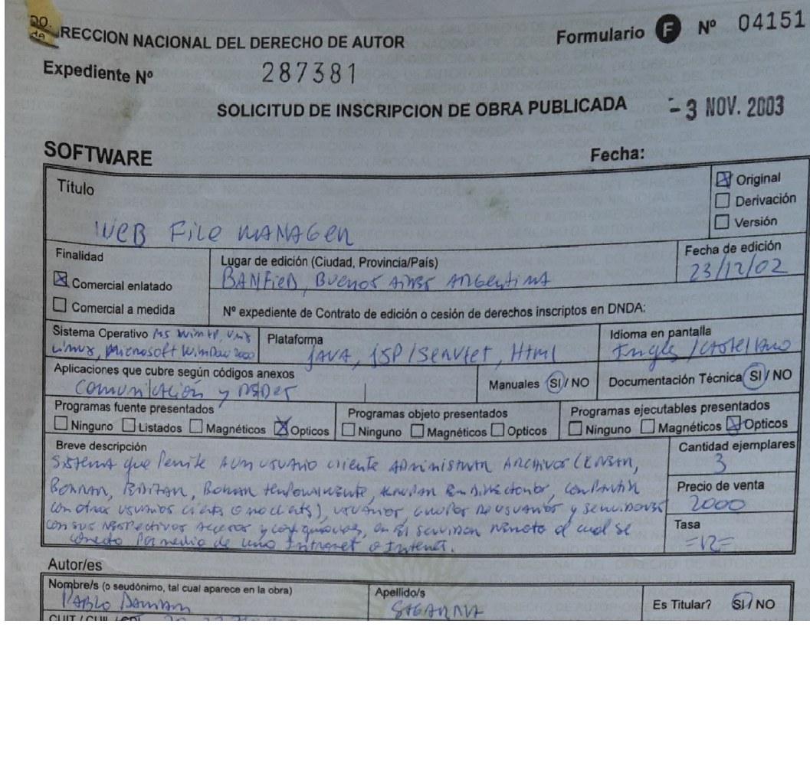

WEFIM (WEB FILE MANAGER) - November 3,2003

Today, we talk about "cloud computing," "SaaS," and "social networks," and we fully understand what these concepts mean. But 24 years ago, explaining them in a patent was far from easy.

This was my invention with which I graduated as an engineer: WEFIM! A web-based system where each user had their own personal space, not only to store files of any type but also to share them with other users. Additionally, each user had a homepage where they could publish any information they wanted to share with others.

Some key features of WEFIM included:

User session management: Each user had a username and password to access the system.

Efficient file organization: Users could perform basic operations such as temporarily deleting files (recycle bin), sharing files with others (generating new versions), downloading files to a local machine for editing, and searching for specific files within the system.

User discovery: Each user could maintain a personal homepage with relevant information to share. This allowed users to find and communicate with others through an internal messaging system.

Information security: User sessions were managed to ensure the safety and privacy of all data.

Customizable workspace: Users could configure their interface according to their preferences.

File transfer via email: Users could send files to others outside the system directly via email.

With these features, WEFIM users no longer needed to carry stacks of CDs or a heavy laptop with important information.

Moreover, WEFIM enabled faster and easier information sharing between users through its advanced browser interface, while maintaining maximum security and data integrity for every user.

Patent:

